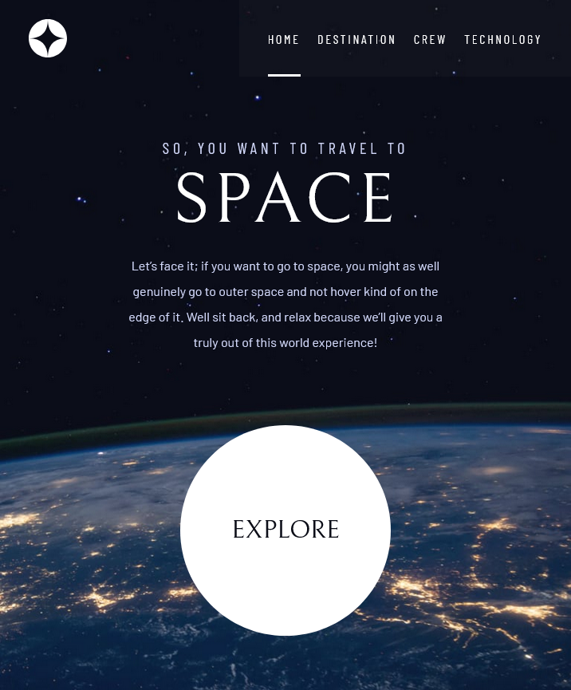
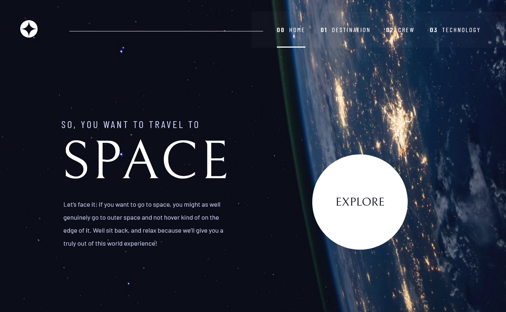

# Frontend Mentor - Space tourism website solution

This is a solution to the [Space tourism website challenge on Frontend Mentor](https://www.frontendmentor.io/challenges/space-tourism-multipage-website-gRWj1URZ3). Frontend Mentor challenges help you improve your coding skills by building realistic projects.

## Table of contents

- [Overview](#overview)
  - [The challenge](#the-challenge)
  - [Screenshot](#screenshot)
  - [Links](#links)
- [My process](#my-process)
  - [Built with](#built-with)
  - [What I learned](#what-i-learned)
  - [Continued development](#continued-development)
- [Author](#author)
- [Acknowledgments](#acknowledgments)

## Overview

### The challenge

Users should be able to:

- View the optimal layout for each of the website's pages depending on their device's screen size
- See hover states for all interactive elements on the page
- View each page and be able to toggle between the tabs to see new information

### Screenshot





### Links

- Solution URL: [GitHub](https://github.com/ania221B/space-tourism-2)
- Live Site URL: [GitHub Pages](https://ania221b.github.io/space-tourism-2/index.html)

## My process

### Built with

- Semantic HTML5 markup
- CSS custom properties
- Flexbox
- CSS Grid
- Mobile-first workflow

### What I learned

#### Colors

I've learnt the new hsl color notation and how to use it in custom properties to manipulate the opacity.

Instead of writing:

```css
--clr-primary: hsl(230, 35%, 7%);
```

You use just the numbers without any commas:

```css
--clr-primary: 230 35% 7%;
```

Later, in order to use the color, you need to remember about writing hsl(). If you want to change opacity, you add it after a backslash:

```css
.bg-primary-medium {
  background-color: hsl(var(--clr-primary) / 0.5);
}
```

You don't need to write `hsla()` for the alpha channel to work.

#### Paddings

You can use clamp(), min() and max() functions for paddings to get them grow and shrink without media queries:

```css
.element-1 {
  padding: 1.5rem clamp(1.5rem, 5vw, 3.5rem);
}

.element-2 {
  padding-block: min(4rem, 20vh);
}
```

#### Fonts

You can use clamp() for fonts. It's a good idea to use `+1rem` for the middle (preferred) value so that font size is always in `rem`:

```css
--fs-900: clamp(5rem, 10vw + 1rem, 9.375rem);
```

#### Accessibility

##### Skip to content link

To make websites easier to navigate for people who use keyboard only, you can add a link enabling them to jump straight to main content without having to tab through the navigation menu. The `href` attribute needs to point to the `id` of main content and it's good to have `aria-label` describing what the link does. The link can be hidden with positioning and transforms.

```html
<a
  href="#main-content"
  class="skip-to-content"
  aria-label="skip to main content"
  >Skip to content</a
>

<main id="main-content"></main>
```

```css
.skip-to-content {
  position: absolute;
  inset: 0 auto auto 0;
  padding: 0.75em 1.5em;
  opacity: 0;
  transform: translateY(-100%);
  transition: opacity 300ms ease-in-out, transform 300ms ease-in-out;
}

.skip-to-content:focus {
  opacity: 1;
  transform: translateY(0);
  transition: opacity 300ms ease-in-out, transform 300ms ease-in-out;
}
```

##### Content for screen readers only

In situations where you have elements like buttons for slide switching that look like dots and therefore ones that don't tell screen-reader users much, it is a good practice to add text to the button and hide it using a class:

```html
<div class="dot-indicators">
  <button type="button"><span class="sr-only">Launch vehicle</span></button>
  <button type="button"><span class="sr-only">Spaceport</span></button>
  <button type="button"><span class="sr-only">Space capsule</span></button>
</div>
```

```css
.sr-only {
  position: absolute !important;
  height: 1px !important;
  width: 1px !important;
  padding: 0 !important;
  margin: -1px !important;
  overflow: hidden !important;
  border: 0 !important;
  clip: rect(0, 0, 0, 0) !important;
  white-space: nowrap !important;
}
```

##### Hidding content from screen readers

If you have content that makes sense for sighted users, but is not really useful for people with impaired vision — like the numbering of navigation menu in this project — it is a good idea to hide it using `aria-hidden` attribute:

```html
<a href="page.html"><span aria-hidden="true">00</span>Home</a>
```

#### `aria-controls` attribute

The `aria-controls` attribute should be placed on an element which impacts presence or contents of another element in the document.

An element that controls another is called a control. An example would be a tab that displays a tab panel associated with it: the tab has `role="tab"` and `aria-controls` pointing to the `tabpanel` it controls.

```html
<button
  type="button"
  role="tab"
  tabindex="0"
  aria-selected="true"
  aria-controls="moon"
>
  Moon
</button>

<article id="moon" role="tabpanel">...</article>
```

##### `tabindex` attribute

The `tabindex` attribute allows elements to gain focus.
The attribute has an integer as a value. In order to make it work in an accessible way, it should have the value of zero or a negative number. A negative value means the element can't be navigated to with the keyboard's `Tab` key but that it can gain focus with the use of JS or by clicking.
`tabindex=0` means that the item can be navigated to with the use of `Tab` key.

#### Using attributes instead of classes in JS

To build navigation menu and tabbed component from this project, I would use classes that are added and removed with the use of JS. I learnt form the course that you can do the same by using attributes.

```html
<button
  type="button"
  class="mobile-nav-toggle"
  aria-controls="primary-nav"
  aria-expanded="false"
>
  <span class="sr-only">Mobile Navigation Menu</span>
</button>

<nav>
  <ul id="primary-nav" class="primary-nav" data-visibility="false">
    <li>
      <a><span aria-hidden="true">00</span>Page 1</a>
    </li>
    <li>
      <a><span aria-hidden="true">01</span>Page 2</a>
    </li>
    <li>
      <a><span aria-hidden="true">02</span>Page 3</a>
    </li>
  </ul>
</nav>
```

```js
const toggleButton = document.querySelector(".mobile-nav-toggle");
const nav = document.querySelector(".primary-nav");

toggleButton.addEventListener("click", (e) => {
  const expanded = toggleButton.getAttribute("aria-expanded");

  if (expanded === "false") {
    toggleButton.setAttribute("aria-expanded", true);
    nav.setAttribute("data-visibility", true);
  } else {
    toggleButton.setAttribute("aria-expanded", false);
    nav.setAttribute("data-visibility", false);
  }
});
```

#### Layout

I couldn't build this layout properly, because I tried to make the components one piece, so for example I would put the tab buttons inside a div together with the content. In order to make it work, individual elements had to be separate.

### Continued development

- Grid
- JS
- Accessibility

## Author

- Frontend Mentor - [@ania221B](https://www.frontendmentor.io/profile/ania221B)

## Acknowledgments

I've rebuilt this website after completing the [Frontend Mentor x Scrimba x Kevin Powell course](https://scrimba.com/learn/spacetravel).
